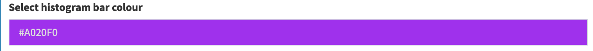

-   [Homework 8: Making a shiny app](#homework-8-making-a-shiny-app)
    -   [Available Features](#available-features)
    -   [Applied Features](#applied-features)
        -   [Feature 1](#feature-1)
        -   [Feature 2](#feature-2)
        -   [Feature 3](#feature-3)
        -   [Feature 4](#feature-4)
        -   [Feature 5](#feature-5)
        -   [Feature 6](#feature-6)
    -   [References](#references)

Homework 8: Making a shiny app
==============================

This is the repo for hw08-yihaoz The aim of hw-08 is to add features to
the BC liquor shiny app and deploy it.

The app can be accessed
[here](%22https://yihaoz.shinyapps.io/bcl_yihaoz/%22)

Available Features
------------------

-   Add an option to sort the results table by price
-   Add an image of the BC Liquor Store to the UI
-   Use the DT package to turn the current results table into an
    interactive table
-   Add parameters to the plot
-   Place the plot and the table in separate tabs
-   Experiment with packages that add extra features to Shiny
-   Show the number of results found whenever the filters change.
-   Allow the user to download the results table
-   Show a new input that allows the user to filter by sweetness level
-   Allow user to search for multiple alcohol types simutaneously,
    instead of being able to choose only wines/beers
-   Provide a way for the user to show results from all countries
    (instead of forcing a filter by only one specific country)

Applied Features
----------------

### Feature 1

-   Add an option to sort the results table by price from low to high
    and high to low

-   

### Feature 2

-   Add an image of the BC Liquor Store to the UI

-   

### Feature 3

-   Place the plot and the table in separate tabs

### Feature 4

-   Use dashboard to add extra features including hidden sidebar and BC
    Liquor Store logo linked to [BC Liquor
    Store](%22http://www.bcliquorstores.com%22)

### Feature 5

-   Add parameters to the plot so that the user can decide on the
    colours of the bars in the plot.

-   

### Feature 6

-   Allow the user to download the results table as a ..csv file.

References
----------

-   [Dean Attali’s
    tutorial](http://deanattali.com/blog/building-shiny-apps-tutorial/)
-   [Rdocumentation](https://www.rdocumentation.org/)

Thank you.
